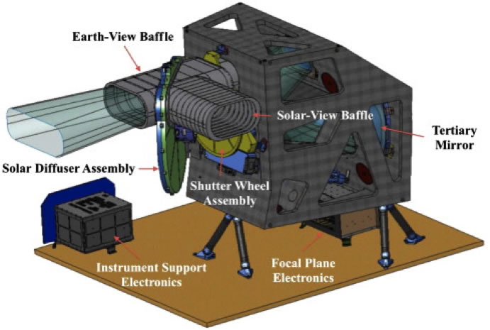
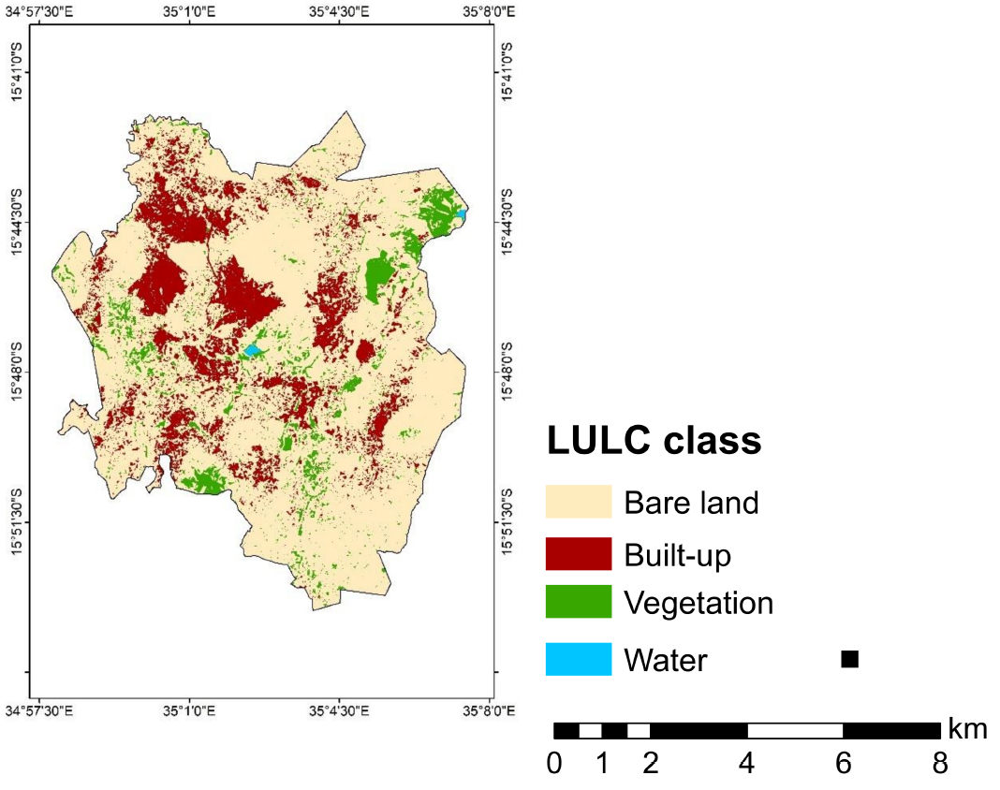
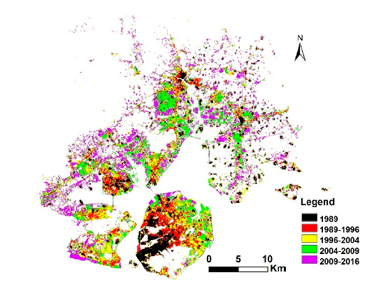

```{r setup, include=FALSE}
options(htmltools.dir.version = FALSE)
library(xaringanthemer)
style_mono_light(base_color = "#562457",
                 header_font_google = google_font("Eczar"),
                 text_font_google = google_font("Kalam"))
```
class: inverse, center, middle
# Outline
## Summary
## Application
## Reflection
---
class: left, left
# Summary

.small[* The Landsat 8 satellite carries the Operational Land Imager (OLI) sensor, which is responsible for measurements in the visible, near-infrared and short-wave infrared components. Its images are available as panchromatic images with a spatial resolution of 15 meters and multi-spectral images of 30 meters. In addition, its observable area is extensive.]

--

* The OLI sensor is a push-broom image acquisition sensor, which has a long array of photosensitive detectors.

--
.pull-left[

```{r echo=FALSE, out.width='60%', fig.align='center'}

```
<font size = 1> Fig.1 Drawing of the Operational Land Imager (OLI)
Source: [**OLI DESIGN**](https://landsat.gsfc.nasa.gov/article/oli-design/)
]

---
class: inverse, left, left
## Application

1.Application in comparing the changes in land use and land cover
.pull-left[
```{r echo=FALSE, out.width='50%', fig.align='center'}
knitr::include_graphics('literature/Application1_1.png')
```
<font size = 1> Fig.2 False color image in Blantyre City collected by OLI sensor 
]

.pull-right[
```{r echo=FALSE, out.width='80%', fig.align='center'}

```
<font size = 1> Fig.3 Land use land cover classes in Blantyre City in 2018 
]

---
class: inverse, left, left
## Application

2.Application in urban land expansion analysis

```{r echo=FALSE, out.width='70%', fig.align='center'}

```
<font size = 1> Fig.4 Urban expansion in Pearl River Delta

---
class: inverse, left, left
## Application

3.Application in monitoring the growth status of crops

---
class: left, left
## Reflection (why interesting & how useful)

* What I have learnt?

The OLI sensor is a significant upgrade over previous sensors carried by the Landsat series of satellites, returning remote sensing images that can be used to target urban, farm, forest and other types of areas.

However, it still has limitations. For instance, because its spatial resolution, it cannot be used to classify classes of land use detailed and monitor land use change in small areas (e.g. Variation of vegetation species distribution in wetland park) 

From this week lecture, I learnt differences between level-1 and level-2 data, and also what is image correlation and enhancement, and the principle of them.

--

* Future work

In the future, I will focus more on exploring other sensors which carried by  satellites launched recently and comparing the differences between them. It might be helpful for me to review the contents in the courses, and also be familiar with the characteristics of these sensors, so that more appropriate data can be selected easier for research according to the different characteristics of the data collected by different sensors.

 

---
class: left, left
##References
--
```{r}
#remotes::install_github("ropensci/RefManageR")
#library(RefManageR)
#library(knitcitations)
#BibOptions(check.entries = FALSE,
#           bib.style = "authoryear",
#           cite.style = "authoryear",
#           style = "markdown",
#           hyperlink = TRUE,
#           dashed = FALSE,
#          no.print.fields=c("doi", "url", "urldate", "issn"))
#myBib <- ReadBib("./literature/RS_wk2/RS_wk2.bib", check = FALSE)
#citep(myBib,"lovelandLandsatBuildingStrong2012")

```

