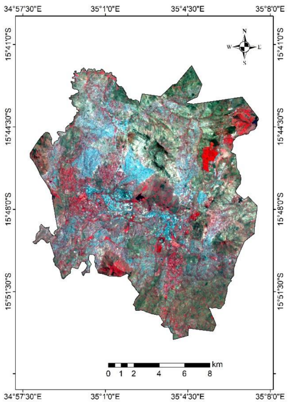

```{r setup, include=FALSE}
options(htmltools.dir.version = FALSE)
library(xaringanExtra)
library(xaringanthemer)
style_mono_light(base_color = "#562457",
                 header_font_google = google_font("Eczar"),
                 text_font_google = google_font("Kalam"))
library(knitcitations)
library(RefManageR)
BibOptions(check.entries = FALSE, bib.style = "authoryear",cite.style = "authoryear", style = "markdown", hyperlink = TRUE, dashed = TRUE, no.print.fields=c("doi", "url", "urldate", "issn"))
myBib <- RefManageR::ReadBib("RS_wk2_pre.bib")

```

```{r xaringanExtra-search, echo=FALSE}
xaringanExtra::use_search(show_icon = TRUE)
```
class: center, middle
# Outline
## Summary
## Application
## Reflection

---
class: left, left
# Summary

.small[* The Landsat 8 satellite carries the Operational Land Imager (OLI) sensor, which is responsible for measurements in the visible, near-infrared and short-wave infrared components `r Citep(myBib,"ironsNextLandsatSatellite2012")`. Its images are available as panchromatic images with a spatial resolution of 15 meters and multi-spectral images of 30 meters. In addition, its observable area is extensive `r Citep(myBib,"ironsNextLandsatSatellite2012")`.]

--

* The OLI sensor is a push-broom image acquisition sensor, which has a long array of photosensitive detectors `r Citep(myBib,"ironsNextLandsatSatellite2012")`.

--
.pull-left[

```{r echo=FALSE, out.width='60%', fig.align='center'}
knitr::include_graphics('literature/oli_design.jpg')
```
<font size = 1> Fig.1 Drawing of the Operational Land Imager (OLI)
Source: [**OLI DESIGN**](https://landsat.gsfc.nasa.gov/article/oli-design/)
]

---
class: left, left
## Application
1.*Application in comparing the changes in land use and land cover*
```{r xaringan-panelset, echo=FALSE}
xaringanExtra::use_panelset()
```
.panelset[
.panel[.panel-name[Summary of Application 1]

`r Citet(myBib,"mawendaAnalysisUrbanLand2020a")` used Landsat series satellite imagery to analyse land use and land cover type changes in Area A from 1994 to 2018. In classifying the land use and land cover types in 2018, remote sensing images returned by the OLI sensor carried by the Landsat 8 satellite were used. They chose the remote sensing images collected by the OLI sensor based on their 30 m spatial resolution and 16-day repetition period, and that their trajectories cover exactly the study area. In addition, the images were acquired at a high quality and no very obvious quality issues or errors were detected. I believe that the use of the data collected by the OLI sensor is appropriate for the subject and accuracy of their study, but if a higher resolution image is required to improve the accuracy of the land use classification, the data collected by the XX sensor may be more appropriate.
]

.panel[.panel-name[Example results]
.pull-left[
```{r echo=FALSE, out.width='50%', fig.align='center'}

```
<font size = 1> Fig.2 False color image in Blantyre City collected by OLI sensor
]

.pull-right[
```{r echo=FALSE, out.width='80%', fig.align='center'}
knitr::include_graphics('literature/Application1_2.png')
```
<font size = 1> Fig.3 Land use land cover classes in Blantyre City in 2018 
]
]
]

---
class:left, left
## Application

2.*Application in urban land expansion analysis*
.panelset[
.panel[.panel-name[Summary of Application 2]
`r Citet(myBib,"huaImpactsExpansionUrban2020")` explored the impacts of urban expansion on urban heat islands in Xiamen, China from 1989 to 2016 based on remote sensing technologies. They used the images collected by OLI sensor to evaluate the urban heat island effect in Xiamen city in 2016, since they need to compute several indices to explore the distribution of different kinds of land use, including NDVI for retrieving vegetation area, MNDVI for retrieving water area,and other indices `r Citep(myBib,"huaImpactsExpansionUrban2020")`. However, one of the most important indices when analyzing urban heart island effects is land surface temperature (LST), authors chose Landsat 8 TIRS images to compute LST based on modified single channel algorithm, not using Landsat 8 OLI images `r Citep(myBib,"huaImpactsExpansionUrban2020")`.
]

.panel[.panel-name[Example results]
```{r echo=FALSE, out.width='50%', fig.align='center'}
knitr::include_graphics('literature/Application2.png')
```
<font size = 1> Fig.4 Calculated urban expansion in Xiamen City from 1989 to 2016.
]

.panel[.panel-name[Discussion]
* This application shows that the resolution of OLI images can assist in the analysis of urban heat island effect and urban expansion analysis based on the urban scale.
* The reason they chose the TIRS images to calculate LST may be that the bands 10 of the TIRS sensor are unique thermal infrared (TIR) bands whereas the OLI sensor does not have thermal infrared bands `r Citep(myBib, "huaImpactsExpansionUrban2020")`.
* Therefore, I think this may be a limitation to using OLI sensor images in future studies, but this problem can be solved by combining OLI images with other sensor images that have TIR bands or by using other sensors, for instance Landsat 7 ETM+ `r Citep(myBib, "nugrahaComparisonLandSurface2019")`.
]
]
---
class:left, left
## Application
3.*Application in monitoring the growth status of crops*
.panelset[
.panel[.panel-name[Summary of Application 3]

]

.panel[.panel-name[Example results]
```{r echo=FALSE, out.width='50%', fig.align='center'}
#knitr::include_graphics('literature/Application3.png')
```
<font size = 1> Fig.5 .
]

.panel[.panel-name[Discussion]

]
]
---
class: left, left
## Reflection
.panelset[
.panel[.panel-name[learnt from Landsat OLI]
* The OLI sensor is a significant upgrade over previous sensors carried by the Landsat series of satellites, returning remote sensing images that can be used to target urban, farm, forest and other types of areas.
* However, it still has limitations. For instance, because its spatial resolution, it cannot be used to classify classes of land use detailed and monitor land use change in small areas (e.g. Variation of vegetation species distribution in wetland park) 
* I find it very interesting that the satellites carry sensors with different characteristics that allow different types of data to be collected and used for different types of analysis, as if a photograph contains a large amount of information, which means that more data can be collected in less time and also reduces the memory footprint.
]

.panel[.panel-name[learnt from Xaringan]
* Xaringan is a very interesting way to make presentation. Xaringan slides can be created with the help of simple codes only, and pages can be very clean.
* After studying and using Xaringan for a while, I think it is more suitable for presentations that involve explaining code than traditional PowerPoint. Because it can directly add code chunk, it is easy to copy and paste code. Moreover, I think Xaringan is easier to reproduce than PowerPoint.
* However, Xaringan currently does not have a note window in PPT, so we cannot write down some notes at any time. In addition, the content marked on the page cannot be saved, which makes it less suitable for taking notes in class or for taking minutes of meetings.
]

.panel[.panel-name[Future work]
* In the future, I will focus more on exploring more applications based on Landsat 8 OLI images and other sensors which carried by satellites launched recently and comparing the differences between them. It might be helpful for me to review the contents in the courses, and also be familiar with different characteristics of these sensors, so that more appropriate images can be selected easier for research in the future.
* The practice and use of Xaringan will continue, and I will try to add more elements to make the Xaringan slides more aesthetically pleasing, such as adding emojis appropriatly, adding animations when switching between slides, videos and musics.
]
]

---
class: left, left
##References

```{r, results='asis', echo=FALSE}
RefManageR::PrintBibliography(myBib)
```

